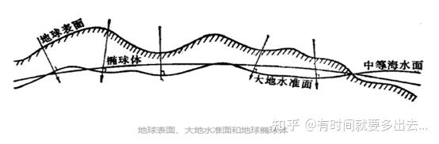
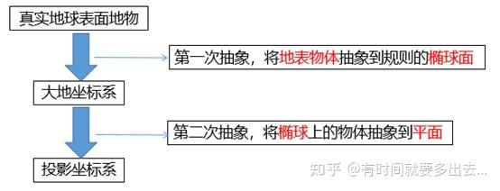
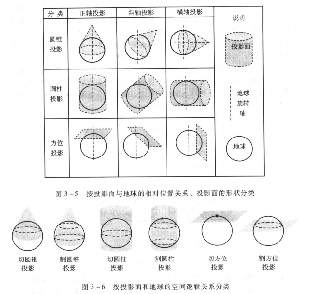
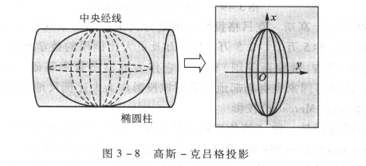
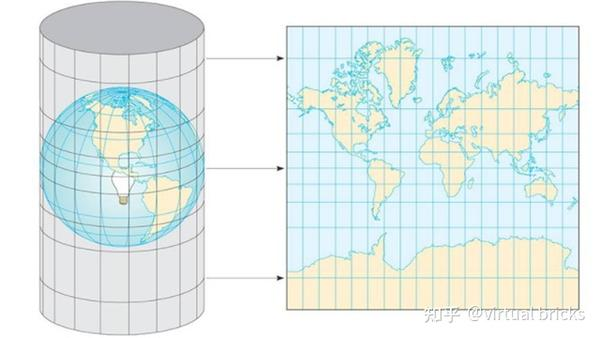
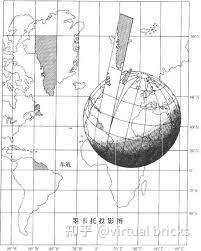
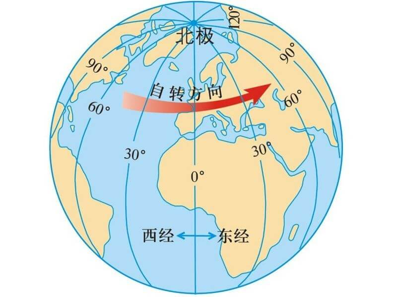
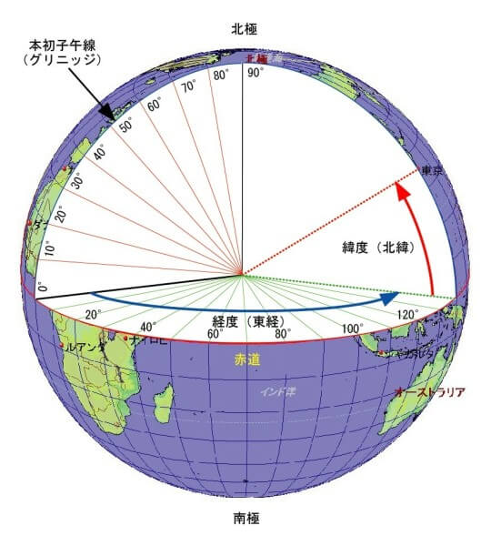

# 基础知识

地球的长半径约为 6378137.0 米，短半径为 6356752.314245179 米。

# 地图投影

## 地图投影的基本原理

要将地球椭球面上的空间信息表现到平面地图上，就必须采用某种数学法则，使空间信息在地球表面上的位置和地图平面位置 一一对应起来。

用数学表达式概略地表示地图投影关系为，其中 $\varphi$ 为经度，$\lambda$ 为纬度，$x$ 和 $y$ 分别为平面坐标。

$$
  x = f1(\varphi, \lambda)
  \\
  y = f1(\varphi, \lambda)
$$


实际操作中，需要经过两次抽象，一次是将地球不规则的球体抽象为椭球体，一次是将椭球体抽象为平面（也就是投影）。

> **两次抽象**
>
> 空间坐标系的定义为：确定地面点或空间目标位置所采用的参考系。由下图可见，地球表面是凹凸不平的；由于地球密度不一，造成各处重力方向不同，大地水准面垂直于重力方向，是不规则的；椭球体是为了贴近大地水准面的规则数学模型。目前最具代表性的模型为WGS84。
> 
>
>
> 将真实的凹凸不平的地表展示到地图上，要经过两次抽象，第一次是将地表物体抽象到规则的椭球面，此时的坐标系为地理坐标系，也称为大地坐标系；第二次是将椭球体上的地物抽象到平面，使用的坐标系为投影坐标系。可以看出，第二次抽象依赖于第一次抽象，即有投影坐标系的地物绝对要先有地理坐标系。
>
> 

## 地图投影的类型

地图投影的类型按投影变形性质可分为等角（正形）投影、等面积投影、等距离和任意投影。

地图投影的类型按投影面与地球的相对位置关系可分为正轴投影、斜轴投影、横轴投影等。

地图投影的类型按投影面的形状可分为圆锥投影、圆柱投影、方位投影等。

地图投影的类型按投影面和地球的空间逻辑关系可分为相切和相割两类投影。



## GIS 中常用的投影

### 高斯-克吕格投影（Gauss-Kruger）

介绍:

*高斯-克吕格投影* 是由德国的高斯(Carl Friedrich Gauss)于19世纪20年代拟定。后由德国的克吕格(Johannes Kruger)于1912年对投影公式加以补充，故名 *高斯-克吕格投影* 。

投影原理

*高斯-克吕格投影* 是等角横切椭圆柱投影，假想使用一个椭圆柱横套在地球椭球体外面，并于某一子午线（这里称为 中央经线）相切，椭圆柱的中心轴位于赤道上。如下图所示，在按照 *高斯-克吕格投影* 所规定的条件，将中央经线两侧一定范围内的经纬线投影到椭圆柱上，并将此椭圆柱展开，即得 *高斯-克吕格投影* 。




*高斯-克吕格投影* 所规定的条件如下：

1. 中央经线和赤道投影后为互相垂直的直线，且为投影的对称轴
2. 投影具有等角性质
3. 中央经线投影后保持长度不变

*高斯-克吕格投影* 特点：

1. 中央经线上没有任何变形，满足中央经线投影后保持长度不变的条件;
2. 除中央经线上的长度比为1外，其他任何点上长度比均大于1;
3. 在同一条纬线上，离中央经线越远，变形越大，最大值位于投影带的
边缘;
4. 在同一条经线上，纬度越低，变形越大，变形最大值位于赤道上;
5. 投影属于等角性质，故没有角度变形，面积比为长度比的平方;
6. 长度比的等变形线平行于中央子午线;


### 墨卡托投影（Mercator）

*墨卡托投影* 由荷兰的 Gerardus Mercator 于1569年提出。

投影原理

墨卡托投影，是正轴等角圆柱投影。假想一个与地轴方向一致的圆柱切或割于地球，按等角条件，将经纬网投影到圆柱面上，将圆柱面展为平面后，即得本投影。




特点

1. 等角性：墨卡托投影是一种等角投影，它保持了地图上所有方向的角度不变，即无论在地图上的任何位置，角度关系都是正确的。
2. 经纬线布局：在墨卡托投影中，经线是均匀分布的垂直平行线，而纬线是水平平行线。随着纬度的增加，纬线之间的距离也会增加。
3. 直线表示：等角航线（恒向航线）在墨卡托投影上表示为直线，这对航海和航空导航非常有用。
4. 形状保持：地图上的小区域形状保持相对准确，特别是接近基准纬线的地方。

优点

1. 导航适用性：由于其等角性，墨卡托投影非常适合于航海和航空导航，可以沿着地图上的直线航行而不需要改变方向。
2. 标准化：墨卡托投影已经被广泛采用，并形成了多个国际标准，如用于海图和部分地图服务中的 Web Mercator 投影。

缺点

1. 面积变形：墨卡托投影的最大缺点是面积变形非常严重，尤其是在高纬度地区。纬度越高，地图上的面积与实际面积的差异就越大。
2. 极地不可表示：理论上，墨卡托投影无法表示极地，因为随着接近两极，纬线的间距会趋向无穷大。
3. 不适用于全球地图：由于其圆柱形的特性，墨卡托投影不适合用于制作完整的全球地图，因为它无法有效地表示两极地区。
4. 长度失真：除了赤道和经线之外，其他航线在墨卡托投影上表示的长度会比实际长度长，这可能导致在长距离航行中选择不太经济的航线。

# 坐标系

## 常见的坐标系分类

GIS 中常见的坐标系主要分为以下几类：

1. 地理坐标系(Geographic Coordinate System, GCS)
   - 地理坐标系是基于一个参考椭球体，以经纬度来定义地球表面位置的坐标系统
   - 常见的地理坐标系有：WGS84(EPSG:4326)、CGCS2000(EPSG:4490)、GCJ02(EPSG:4490)、BD09(EPSG:4490)、WGS72(EPSG:4326)等
2. 投影坐标系(Projected Coordinate System, PCS)
   - 投影坐标系是将地球的三维表面投影到二维平面上的一种坐标系统
   - 常见的投影坐标系有：墨卡托投影、UTM 投影、Lambert 投影、Albers 投影等


## 墨卡托坐标系

坐标原点：赤道与本初子午线的交点 为 坐标原点。

X、Y 坐标：在墨卡托投影中，X 坐标表示从本初子午线到点的东西方向距离，Y 坐标表示从赤道到点的南北方向距离。

# 经纬度与投影坐标之间的转换

地理坐标 (经度$\lambda$、纬度$\phi$) 到平面坐标 ($X$, $Y$)的转换公式如下：

X 轴：

$$
    X = R \cdot \lambda
$$

Y 轴：

$$
    Y = R \cdot \ln \left( \tan \left( \frac{\pi}{4} + \frac{\phi}{2} \right) \right)
$$

```js
// 弧度版
function latLngToMercator(lat, lng, isRadian = true) {
  const R = 6378137; // 地球半径，单位：米
  if (!isRadian) {
    // 角度转弧度
    lat = (lat * Math.PI) / 180;
    lng = (lng * Math.PI) / 180;
  }
  const x = R * lng;
  const y = R * Math.log(Math.tan(Math.PI * 0.25 + 0.5 * lat));
  return { x, y };
}
```

> 引用
>
> [Web 墨卡托投影 （概念,公式与实现）](https://zhuanlan.zhihu.com/p/690916973) > [真正的墨卡托投影转换详解](https://zhuanlan.zhihu.com/p/326955505)

# 经纬度

水平方向的线为经度线，垂直方向的线为纬度线。

<mark>经线</mark>：定义为地球表面连接南北两极的大圆线上的半圆弧。任两根经线的长度相等，相交于南北两极点。每一根经线都有其相对应的数值，称为经度。经线指示南北方向。从本初子午线向东和向西，各分 180°，称为东经和西经，分别用“E”和“W”表示。

<mark>纬线</mark>：定义为地球表面某点随地球自转所形成的轨迹。任何一根纬线都是圆形而且两两平行。纬线的长度是赤道的周长乘以纬线的纬度的余弦，所以赤道最长，离赤道越远的纬线，周长越短，到了两极就缩为 0。从赤道向北和向南，各分 90°，称为北纬和南纬，分别用“N”和“S”表示。




# 空间数据

## GIS 空间数据的分类

| 按数据来源 | 按数据结构 | 按数据特征     | 按几何特征 | 按数据发布形式 |
| ---------- | ---------- | -------------- | ---------- | -------------- |
| 地图数据   | 矢量数据   | 空间数据       | 点         | 数字线画图     |
| 影像数据   | 栅格数据   | 非空间属性数据 | 线         | 数字栅格图     |
| 文本数据   |            |                | 面、曲面   | 数字高程模型   |
|            |            |                | 体         | 数字正射影像图 |

## GIS 空间数据结构

GIS 空间数据结构可分为 矢量数据结构 和 栅格数据结构。

### 矢量数据结构

其中矢量数据结构 又可以分为 实体数据结构 和 拓扑数据结构。

在实体数据结构中，空间数据按照基本的空间对象（点、线 或 多边形）为单元进行单独组织，其中不含有拓扑关系的信息。采用这种数据结构的有 Shape 文件、Tab 文件等。


拓扑数据结构，包括 DIME（对偶独立地图编码法）、POLYVERT（多边形转换器）、TIGER（地理编码和参照系统的拓扑集成）等。他们的共同特点是：点是相互独立的，点连成线，线构成面。


常见的 矢量数据格式：shape、kml、GeoJSON、TopoJSON 等

### 栅格数据结构

栅格数据结构，是指将空间分割成有规则的网格，称为栅格单元，在各个栅格单元上给出相应的属性值来表示地理实体的一种数据组织形式。

栅格数据通常用于 存储 影像数据。WMS 与 WMTS 都是用 栅格数据 存储。

## 空间数据库

空间数据库

PostGIS
