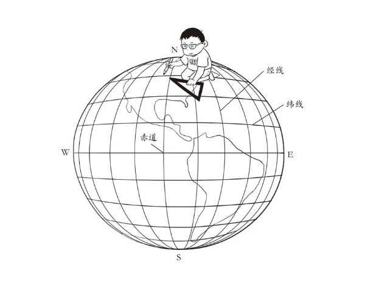

# 地理坐标系

## 经纬度
  水平方向的线为经度线，垂直方向的线为纬度线。
  
  <mark>经线</mark>：定义为地球表面连接南北两极的大圆线上的半圆弧。任两根经线的长度相等，相交于南北两极点。每一根经线都有其相对应的数值，称为经度。经线指示南北方向。从本初子午线向东和向西，各分180°，称为东经和西经，分别用“E”和“W”表示。
  
  <mark>纬线</mark>：定义为地球表面某点随地球自转所形成的轨迹。任何一根纬线都是圆形而且两两平行。纬线的长度是赤道的周长乘以纬线的纬度的余弦，所以赤道最长，离赤道越远的纬线，周长越短，到了两极就缩为0。从赤道向北和向南，各分90°，称为北纬和南纬，分别用“N”和“S”表示。

  

## WGS84坐标系

