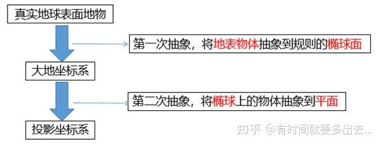
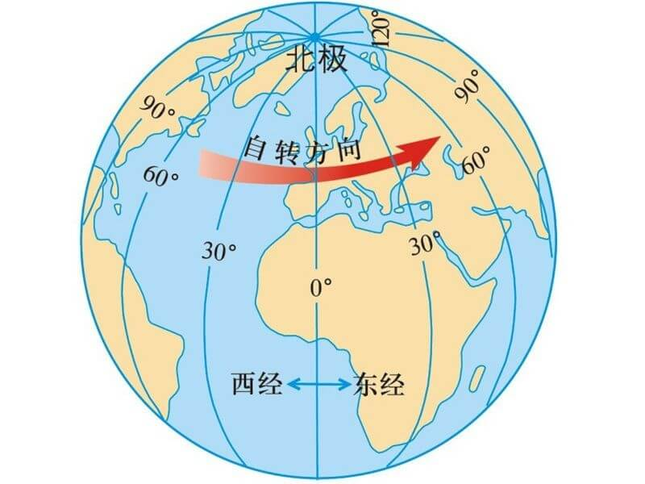

# 基础知识

地球的长半径约为 6378137.0 米，短半径为 6356752.314245179 米。

# 坐标系

## 常见的坐标系分类

GIS 中常见的坐标系主要分为以下几类：

1. 地理坐标系(Geographic Coordinate System, GCS)
   - 地理坐标系是基于一个参考椭球体，以经纬度来定义地球表面位置的坐标系统
   - 常见的地理坐标系有：WGS84(EPSG:4326)、CGCS2000(EPSG:4490)、GCJ02(EPSG:4490)、BD09(EPSG:4490)、WGS72(EPSG:4326)等
2. 投影坐标系(Projected Coordinate System, PCS)
   - 投影坐标系是将地球的三维表面投影到二维平面上的一种坐标系统
   - 常见的投影坐标系有：墨卡托投影、UTM 投影、Lambert 投影、Albers 投影等

## 空间坐标系与两次抽象

空间坐标系的定义为：确定地面点或空间目标位置所采用的参考系。由下图可见，地球表面是凹凸不平的；由于地球密度不一，造成各处重力方向不同，大地水准面垂直于重力方向，是不规则的；椭球体是为了贴近大地水准面的规则数学模型。


将真实的凹凸不平的地表展示到地图上，要经过两次抽象，第一次是将地表物体抽象到规则的椭球面，此时的坐标系为地理坐标系，也称为大地坐标系；第二次是将椭球体上的地物抽象到平面，使用的坐标系为投影坐标系。可以看出，第二次抽象依赖于第一次抽象，即有投影坐标系的地物绝对要先有地理坐标系。



# 常见的投影方式

## 墨卡托投影

墨卡托投影，是正轴等角圆柱投影。假想一个与地轴方向一致的圆柱切或割于地球，按等角条件，将经纬网投影到圆柱面上，将圆柱面展为平面后，即得本投影。


## 墨卡托坐标系

坐标原点：赤道与本初子午线的交点 为 坐标原点。

X、Y 坐标：在墨卡托投影中，X 坐标表示从本初子午线到点的东西方向距离，Y 坐标表示从赤道到点的南北方向距离。

# 经纬度与投影坐标之间的转换

地理坐标 (经度$\lambda$、纬度$\phi$) 到平面坐标 ($X$, $Y$)的转换公式如下：

X 轴：

$$
    X = R \cdot \lambda
$$

Y 轴：

$$
    Y = R \cdot \ln \left( \tan \left( \frac{\pi}{4} + \frac{\phi}{2} \right) \right)
$$

```js
// 弧度版
function latLngToMercator(lat, lng, isRadian = true) {
  const R = 6378137; // 地球半径，单位：米
  if (!isRadian) {
    // 角度转弧度
    lat = (lat * Math.PI) / 180;
    lng = (lng * Math.PI) / 180;
  }
  const x = R * lng;
  const y = R * Math.log(Math.tan(Math.PI * 0.25 + 0.5 * lat));
  return { x, y };
}
```

> 引用
>
> [Web 墨卡托投影 （概念,公式与实现）](https://zhuanlan.zhihu.com/p/690916973) > [真正的墨卡托投影转换详解](https://zhuanlan.zhihu.com/p/326955505)

# 经纬度

水平方向的线为经度线，垂直方向的线为纬度线。

<mark>经线</mark>：定义为地球表面连接南北两极的大圆线上的半圆弧。任两根经线的长度相等，相交于南北两极点。每一根经线都有其相对应的数值，称为经度。经线指示南北方向。从本初子午线向东和向西，各分 180°，称为东经和西经，分别用“E”和“W”表示。

<mark>纬线</mark>：定义为地球表面某点随地球自转所形成的轨迹。任何一根纬线都是圆形而且两两平行。纬线的长度是赤道的周长乘以纬线的纬度的余弦，所以赤道最长，离赤道越远的纬线，周长越短，到了两极就缩为 0。从赤道向北和向南，各分 90°，称为北纬和南纬，分别用“N”和“S”表示。




# GIS 数据获取网站集合

