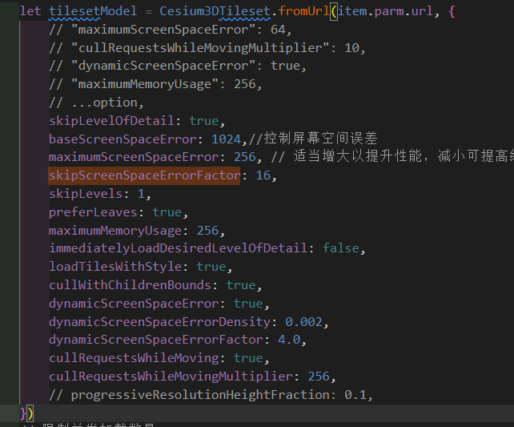
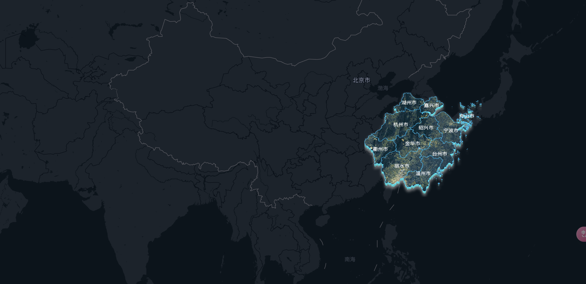

# 2025.2.14 

## cesium加载3DTileset数据量比较大的模型，加载很慢，即使加载成功也很模糊，有没有大佬有解决方案，配置了很多尝试都没有用

思考几个问题：

1、是否是数据量太大导致的
2、数据量太大 为什么会导致 cesium加载很慢




## cesium底图上实现一个类似3d的区域地图有办法做吗，鼠标拖动时，区域地图能跟着平面底图一起移动



## 实现个性化的地图 底图，群友说是 用 blender数据可视化大屏，待研究


## Three.js 3d模型加载慢

使用 LOD 方式。Three.js 中的 THREE.LOD 类允许你为同一个物体定义多个不同细节层次的模型。当相机靠近物体时，使用高细节的模型；当相机远离物体时，切换到低细节的模型，从而减少不必要的渲染开销。通常需要我们提前准备同一物体的不同细节层次的模型文件，例如 高/中/低

```ts
import * as THREE from 'three';
import { GLTFLoader } from 'three/addons/loaders/GLTFLoader.js';

const lod = new THREE.LOD();

// 1. 加载不同细节层次的模型
const loader = new GLTFLoader();

// 加载高细节模型
loader.load('high_detail_model.glb', function (gltf) {
    const highDetailModel = gltf.scene;
    // 添加高细节模型到 LOD 中，并指定切换距离为 0
    lod.addLevel(highDetailModel, 0);
});

// 加载中细节模型
loader.load('medium_detail_model.glb', function (gltf) {
    const mediumDetailModel = gltf.scene;
    // 添加中细节模型到 LOD 中，并指定切换距离为 100
    lod.addLevel(mediumDetailModel, 100);
});

// 加载低细节模型
loader.load('low_detail_model.glb', function (gltf) {
    const lowDetailModel = gltf.scene;
    // 添加低细节模型到 LOD 中，并指定切换距离为 200
    lod.addLevel(lowDetailModel, 200);
});

// 2. 将 LOD 对象添加到场景中
const scene = new THREE.Scene();
scene.add(lod);

// 3. 在每次渲染时，需要调用 lod.update(camera) 方法来根据相机与 LOD 对象的距离动态切换模型的细节层次。
const renderer = new THREE.WebGLRenderer();
renderer.setSize(window.innerWidth, window.innerHeight);
document.body.appendChild(renderer.domElement);

const camera = new THREE.PerspectiveCamera(75, window.innerWidth / window.innerHeight, 0.1, 1000);
camera.position.z = 5;

function animate() {
    requestAnimationFrame(animate);

    // 更新 LOD
    lod.update(camera);

    renderer.render(scene, camera);
}

animate();
```

## 天空盒的制作

https://juejin.cn/post/7440872943946760202?searchId=20250226092838053BE12CBFD89F67B1AD

https://mp.weixin.qq.com/s/FFq1pdRgur98SSkc0V4-iQ